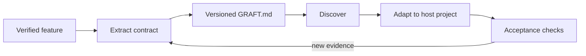

AgentGrafts turns feature reuse into a three-stage workflow.

## Extract

Start from behavior, not from a file list.
Bound the feature, inspect its tests and configuration, and identify the decisions that another project must preserve.

<AccordionGroup>
  <Accordion title="Scope the feature">Name the user-visible capability and the boundary around it. Include adjacent validation, persistence, jobs, and tests only when they are part of the behavior.</Accordion>
  <Accordion title="Capture evidence">Use production behavior, test cases, API contracts, and operational constraints as evidence. Mark assumptions instead of presenting them as facts.</Accordion>
  <Accordion title="Remove private coupling">Replace internal paths, product names, and provider-specific details with portable concepts.</Accordion>
</AccordionGroup>

## Package

Commit the Graft next to the project or publish it to a registry.
Use semantic versions when the contract changes, and keep optional material discoverable through predictable folders.

## Apply

The destination agent should adapt the contract to local conventions, then validate observable behavior.
It should not blindly copy source code or introduce features listed as out of scope.

<Warning>A Graft is not a promise that every implementation detail transfers unchanged. It is a precise boundary for what must remain true while the implementation grows natively in its new host.</Warning>
