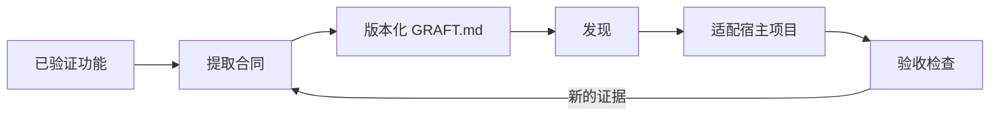

AgentGrafts 把功能复用变成三个阶段的工作流。

## Extract，提取

从行为开始，而不是从文件清单开始。
先圈定功能边界，再检查测试与配置，最后识别目标项目必须保留的决策。

<AccordionGroup>
  <Accordion title="圈定功能">命名用户可见能力及其边界。只有在属于该行为时，才纳入相邻的校验、持久化、任务和测试。</Accordion>
  <Accordion title="记录证据">用生产行为、测试用例、API 合同和运行约束作为证据。把假设标记为假设。</Accordion>
  <Accordion title="移除私有耦合">把内部路径、产品名称和供应商细节替换为可移植概念。</Accordion>
</AccordionGroup>

## Package，打包

将 Graft 和项目一起提交，或发布到 Registry。
合同发生变化时使用语义化版本，并通过可预测的目录保存可选材料。

## Apply，应用

目标 Agent 应该根据本地约定适配合同，再验证可观察行为。
它不应该盲目复制源码，也不应该引入 Out of Scope 中的功能。

<Warning>Graft 不承诺每个实现细节都能原样迁移。它定义的是必须保持成立的边界，让实现可以在新宿主中自然生长。</Warning>
